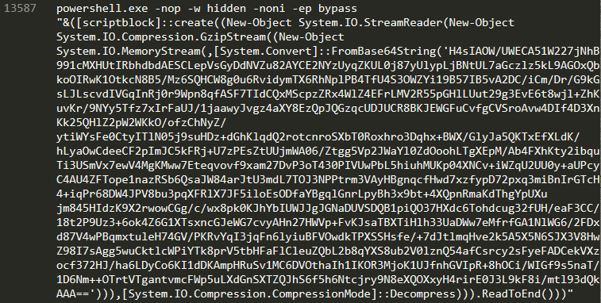
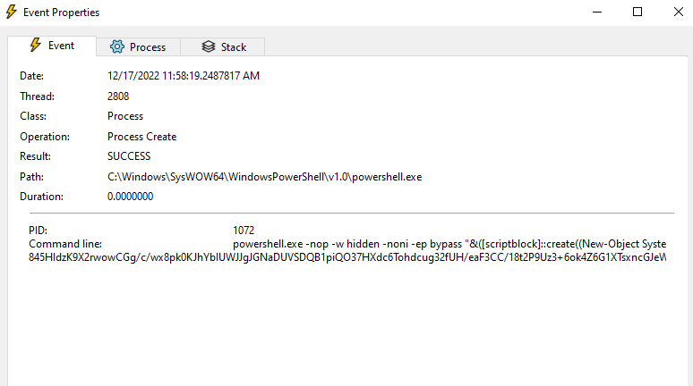
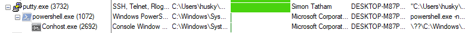
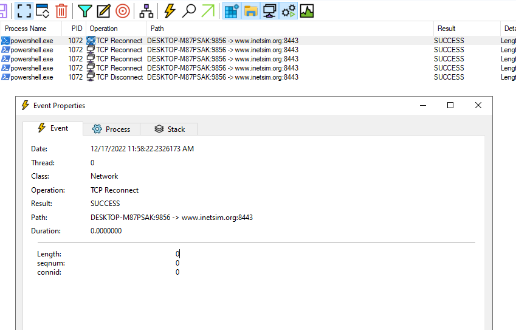
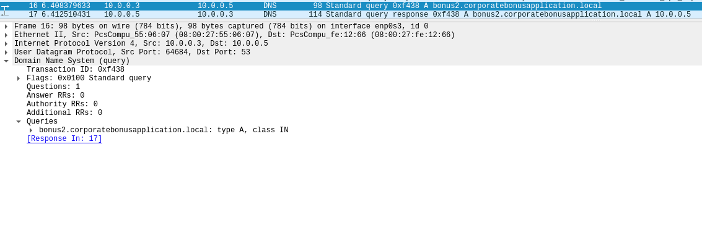
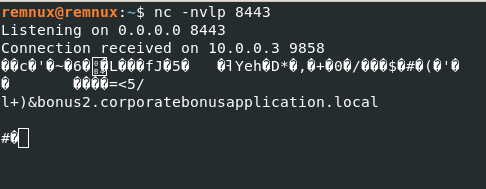
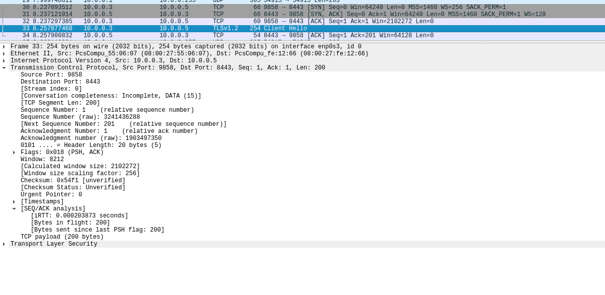
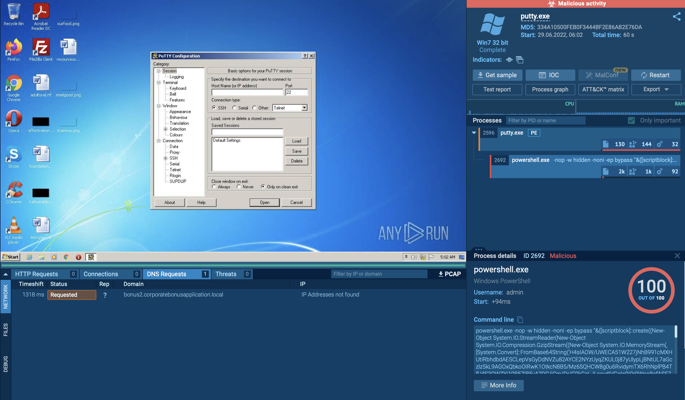

## Executive Summary
`Placeholder`

## Malware Composition

|  File Name     |  SHA256 Hash  |
|----------------|---------------|
|  putty.exe  |  0c82e654c09c8fd9fdf4899718efa37670974c9eec5a8fc18a167f93cea6ee83  |

## VT Analysis
[VT Link](https://www.virustotal.com/gui/file/0c82e654c09c8fd9fdf4899718efa37670974c9eec5a8fc18a167f93cea6ee83/relations) (Detection score 59/72)  
  
No other significative results to be reported.

## Basic Static Analysis
### FLOSS interesting findings

### PEStudio findings
* found a suspicious section: `.00cfg`
* found a suspicious entry-point `.text:0x00122000`

### IAT interesting findings
* `ShellExecuteA` and some Windows Registry related imports (may be Putty normal functionality related)

## Basic Dynamic Analysis
### Initial detonation
* upon detonation a blue Powershell window appears for a few seconds before the standard Putty window.

### Host-based indicators 
* a `Process Create` operation is executed after detonation, which confirms the Powershell command execution we found during the strings analysis.

* the `process tree` can also confirm that putty.exe executed Powershell

  
* by analysing any TCP operations we can notice that the Powershell command seems to be trying to establish a TCP connection to port `8443`

### Network signatures
* found DNS queries to `bonus2.corporatebonusapplication[.]local`

* by setting up a listener on port `8443` and re-detonating the sample we can get a TCP connection (Wireshark reports a TLS `Client Hello`)

## Advanced Static Analysis
* TO DO: base64 decode and gzip decompressing the payload

## Advanced Dynamic Analysis
Not needed.

## Any.run Analysis
* by searching the SHA256SUM on App.any.run we can find some tasks [(Link here)](https://app.any.run/tasks/0ee9dac1-f2e8-406d-a141-3f8e0be6a5af/) that can confirm the Powershell payload and the DNS query. No other findinds are reported. 

## Indicators of Compromise (IOCs)
### Network Indicators
`Placeholder`

### Network Indicators
`Placeholder`

## Rules & Signatures
`Placeholder`