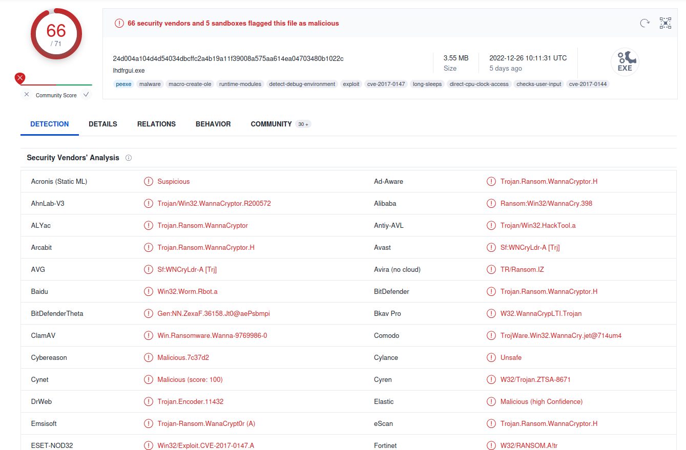
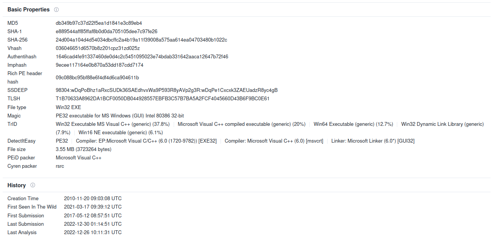
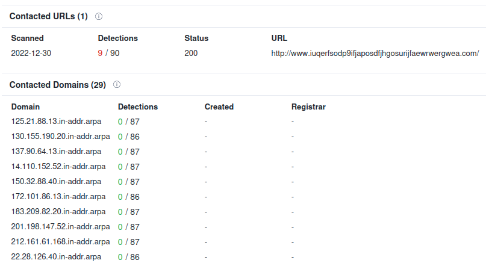
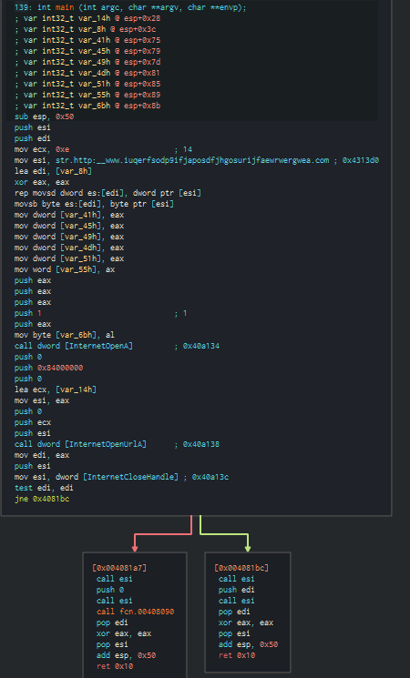
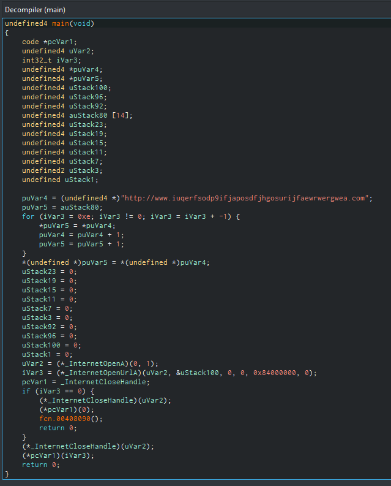
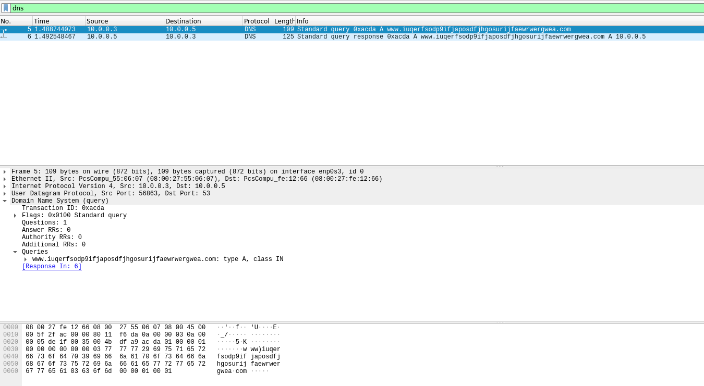
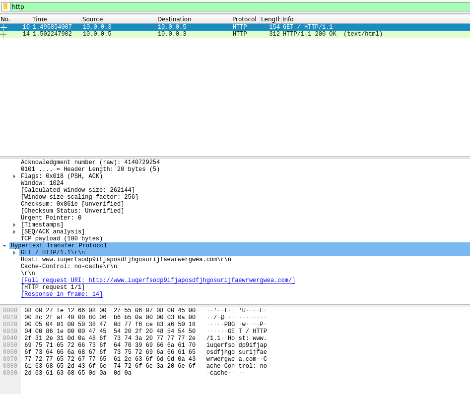

## EXECUTIVE SUMMARY
placeholder

## MALWARE COMPOSITION

|  File Name     |  SHA256 Hash  |
|----------------|---------------|
|  wannacry.exe  |  24d004a104d4d54034dbcffc2a4b19a11f39008a575aa614ea04703480b1022c  |

## VT ANALYSIS
[VT Link](https://www.virustotal.com/gui/file/24d004a104d4d54034dbcffc2a4b19a11f39008a575aa614ea04703480b1022c)

*Figure 1. Virustotal shows multiple AV detections of the sample.*

*Figure 2. Basic properties and timestamps of the analyzed sample.*
  

*Figure 3. Contacted URLs and domains.*
  

## BASIC STATIC ANALYSIS
### STRINGS ANALYSIS
| FLOSS output |
|--------------|
| http://www[.]iuqerfsodp9ifjaposdfjhgosurijfaewrwergwea[.]com |
| cmd.exe /c "%s" |
| %s\ProgramData |
| %s -m security |
| C:\%s\qeriuwjhrf |
| tasksche.exe |
| WanaCrypt0r |
| \\172.16.99.5\IPC$ |
| \\192.168.56.20\IPC$ |
| unzip 0.15 Copyright 1998 Gilles Vollant |
| inflate 1.1.3 Copyright 1995-1998 Mark Adler |
| multiple strings containing file extensions (eg. doc, zip, jpeg) |
| multiple strings containing .wnry extension (eg. msg/m_italian.wnry) |

*Table 1. This is a list of the most interesting findings of the FLOSS output.*
  
### IMPORT ADDRESS TABLE ANALYSIS
| IAT |
|-----|
|InternetOpen|
|InternetOpenUrl|
|VirtualProtect|
|WriteFile|
|DeleteFile|
|MoveFile|
|RegCreateKey|
|RegSetValueEx|
|CreateProcess|
|TerminateProcess|
|CryptGenRandom|
|CryptEncrypt|
|CryptDecrypt|
|CryptImportKey|
|CryptDestroyKey|
|CryptGenKey|

*Table 2. This is a list of the most interesting findings of IAT.*
  
### OTHER NOTES
By analyzing the .data section, the PE seems to contain multiple blocks starting with the hexadecimal "4D 5A" magic number ("MZ" string). Are there multiple files embedded?  

## ADVANCED STATIC ANALYSIS
An advanced analysis with Cutter reveals that the sample tries to request the `http://www[.]iuqerfsodp9ifjaposdfjhgosurijfaewrwergwea[.]com` domain and, if it exists, it exits without harming the machine, else it executes the rest of the program by calling the `fcn.00408090` function (see Figure 6 and 7 below).  

This is basically the killswitch of this ransomware.  

*Figure 6. The main function graph of the specimen.*  

*Figure 7. The decompiled main function (Ghidra decompiler).*  

## BASIC DYNAMIC ANALYSIS
### INITIAL DETONATION (inetsim)
By detonating the specimen, apparently nothing seems to be happening if using a simulated network (eg. inetsim/fakenet), but Wireshark reports some DNS queries and HTTP request to the `http://www[.]iuqerfsodp9ifjaposdfjhgosurijfaewrwergwea[.]com` domain.
  

*Figure 4. Wireshark DNS type A query.*  

*Figure 5. Wireshark HTTP request.*  

It seems to be a "check" that the sample make in order to execute itself (maybe to check if it's running on a VM with a simulated network?).  

### INITIAL DETONATION (no network)
placeholder

## ADVANCED DYNAMIC ANALYSIS
placeholder  

## ANY.RUN ANALYSIS
* [(Link here)](https://app.any.run/tasks/e3d881a5-28f5-451e-9b90-7c4e8e93944c/) 
  
placeholder

## INDICATORS OF COMPROMISE (IOCs)
### HOST-BASED INDICATORS
placeholder  

### NETWORK INDICATORS
placeholder  

## RULES & SIGNATURES
`Placeholder`